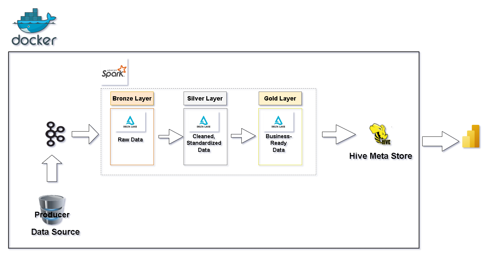
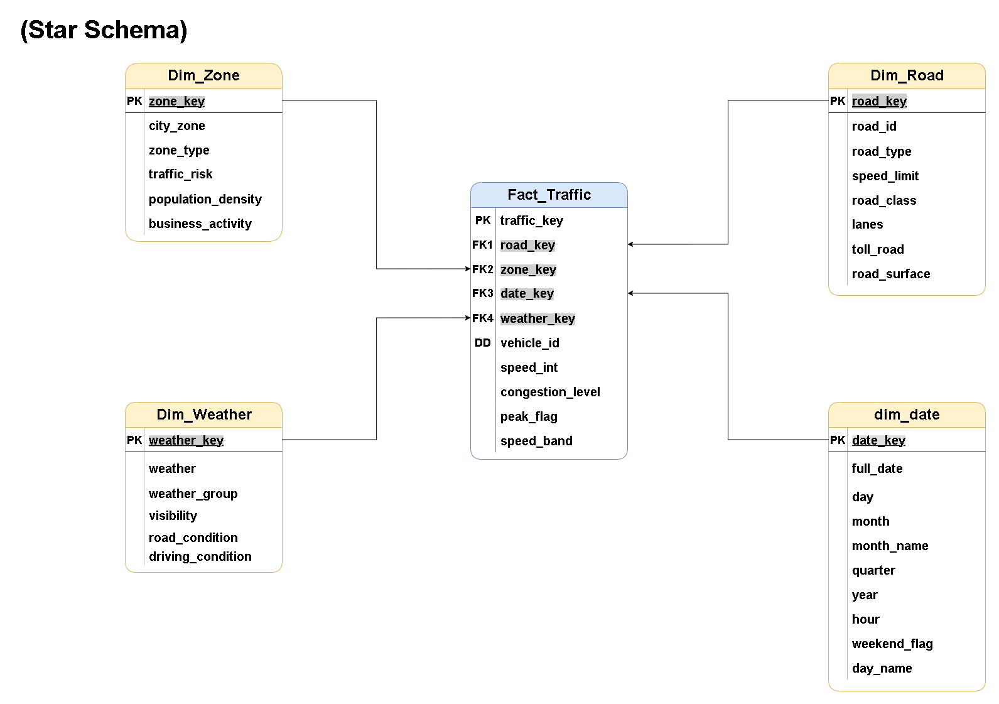
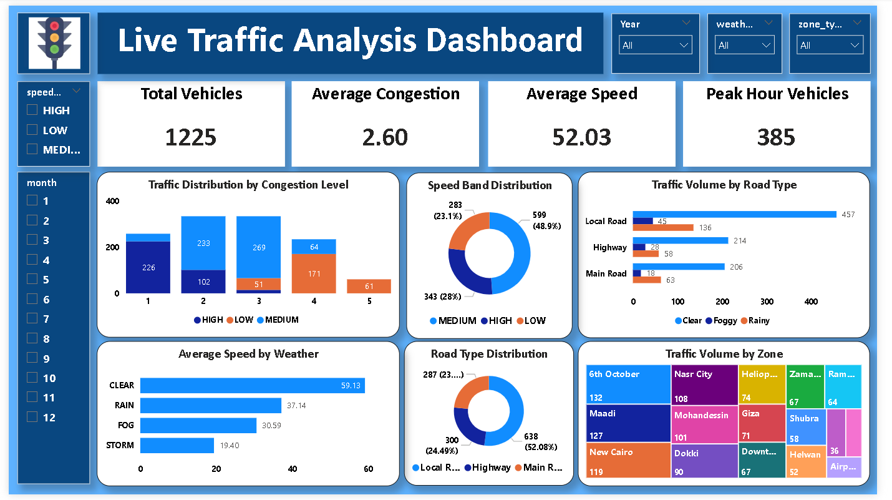

# 🚦 Real-Time Traffic Data Engineering Pipeline

Welcome to the **Real-Time Traffic Data Engineering Pipeline** repository! 🚀

This project demonstrates an end-to-end **Real-Time Data Engineering Pipeline** for processing traffic data using modern big data technologies. It covers real-time data ingestion, distributed processing, data warehousing, dimensional modeling, and business intelligence reporting.
**.

---

# 🏗️ Data Architecture

The project follows the **Medallion Architecture** using **Bronze**, **Silver**, and **Gold** layers.

### 🥉 Bronze Layer

Stores raw streaming traffic events exactly as received from Apache Kafka.

- Raw data ingestion
- Schema enforcement
- Delta Lake storage

---

### 🥈 Silver Layer

Transforms raw traffic events into clean and standardized datasets.

- Data cleaning
- Duplicate removal
- Feature engineering
- Data validation
- Standardization

---

### 🥇 Gold Layer

Stores business-ready analytical tables optimized for reporting and dashboarding.

The Gold layer is modeled using a **Star Schema** to support analytical queries and Power BI dashboards.

---

# 📖 Project Overview

This project includes:

1. **Real-Time Data Streaming** using Apache Kafka.
2. **Distributed Data Processing** using Apache Spark Structured Streaming.
3. **Medallion Architecture** with Bronze, Silver, and Gold layers.
4. **Delta Lake** for reliable and scalable storage.
5. **Star Schema** dimensional modeling.
6. **Interactive Power BI Dashboard** for business insights.
7. **Dockerized Infrastructure** for easy deployment.

---

# ⚙️ Technology Stack

| Category | Technology |
|----------|------------|
| Programming | Python |
| Streaming | Apache Kafka |
| Processing | Apache Spark Structured Streaming |
| Storage | Delta Lake |
| Metadata | Hive Metastore |
| Query Engine | Spark SQL |
| Data Warehouse | Medallion Architecture |
| Visualization | Power BI |
| Containerization | Docker & Docker Compose |

---

# 🏛️ Project Architecture

> Project Architecture Diagram



---


# ⭐ Data Model

The analytical layer is designed using a **Star Schema**.



---

# 📊 Power BI Dashboard

The Power BI dashboard provides interactive insights into traffic conditions and key performance indicators.



Dashboard includes:

- Total Vehicles
- Average Speed
- Average Congestion Level
- Peak Hour Percentage
- Traffic Distribution by Congestion Level
- Traffic Volume by Road Type
- Average Speed by Weather
- Road Type Distribution
- Speed Band Distribution
- Traffic Volume by Zone

---

# 📂 Repository Structure

```text
Real-Time-Traffic/
│
├── apps/
│   ├── bronze/
│   │   └── traffic_bronze.py
│   │
│   ├── silver/
│   │   └── traffic_silver.py
│   │
│   ├── gold/
│   │   ├── dimensions/
│   │   ├── fact_tables/
│   │   └── ...
│   │
│   ├── maintenance/
│   │   └── optimize_silver.py
│   │
│   └── quality/
│       ├── silver_quality_report.py
│       └── gold_validation.py
│
├── producer/
│   └── producer.py
│
├── hive-conf/
│   ├── Dockerfile
│   └── hive-site.xml
│
├── spark/
│   ├── Dockerfile
│   └── spark-conf/
│       └── spark-defaults.conf
│
├── warehouse/
│   ├── chk/
│   ├── traffic_bronze/
│   ├── traffic_silver/
│   ├── traffic_quarantine/
│   ├── gold/
│   └── silver_quality_report/
│
├── PowerBI/
│   ├── Real_Time_Traffic.pbix
│   └── dashboard.png
│
├── Pipeline.png
├── star-schema.png
├── docker-compose.yml
├── .env
├── README.md
└── LICENSE
```

---

# 🚀 Getting Started

### Clone the repository

```bash
git clone https://github.com/Mohamed-2023139/Real-Time-Traffic.git
```

### Navigate to the project directory

```bash
cd Real-Time-Traffic
```

### Build and start all services

```bash
docker compose up -d --build
```

### Verify running services

```bash
docker ps
```

---

# 🐳 Docker Services

The project consists of the following Docker containers:

- Apache Kafka
- Spark Master
- Spark Worker
- Spark Thrift Server
- Hive Metastore
- PostgreSQL (Hive Metastore Database)

---


## ☕ Stay Connected
Let's stay in touch! Feel free to connect with us:  

**LinkedIn**

[](https://www.linkedin.com/in/mohamed-yasser-5a56672ab/)

